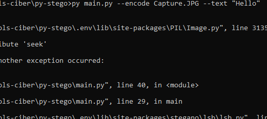
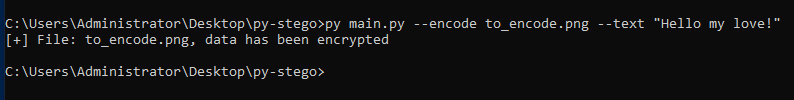

# Py-Stego
<p align=center><a href="#"><a></p>
<p align="center">
  <a href="#"></a>
  <a href="#"></a>
  <a href="#"></a>
</p>

<p>
    Py-Stego is a open source project dedicated to steganography text in images PNG
</p>

---

### 📄 File Support
* PNG

## 🛠 Downloading repo, cd path and install requirements:
```bash
git clone https://github.com/M20191/py-stego && cd py-stego/ && pip install -r requirements.txt
```
## 🐍 Usage Encode
```bash
python/python3 main.py --text "Secret!!" --encode to_encode.png
```
## 🐍 Usage Decode
```bash
python/python3 main.py --decode to_encode_encoded.png
```
## 📌 Arguments
```bash
Usage: py/python3 main.py [-h] [-t] {-e,-d}

Arguments:
  -h, --help         Show this help message
  -t, --text         Text to encode
  -e, --encode       Image file to encode data
  -d, --decode       Image to decode data
```
## 🔒 Normal image


## 🔐 Encrypted image

